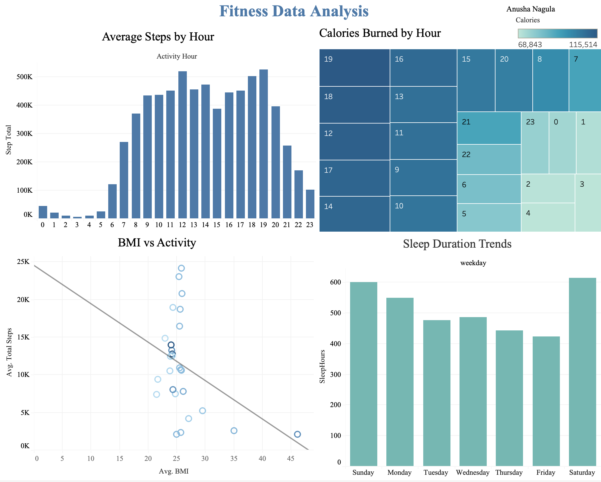

# Bellabeat Fitness Data Analytics (R) - User Behavior Case Study

## Project Overview
This project analyzes smart device fitness tracker data to uncover user activity patterns, health behavior trends, and actionable product insights for Bellabeat, a wellness technology company.
Using real Fitbit usage data, the goal was to transform raw behavioral logs into business recommendations that can improve customer engagement and product strategy.

## Dataset
FitBit daily activity dataset (Kaggle)

## 🎯 Business Questions
- When are users most active during the day?
- How do activity levels relate to calories burned?
- Is there a relationship between BMI and physical activity?
- How can Bellabeat increase user engagement and healthy habits?

## 🛠 Tech Stack
- R
- tidyverse (dplyr, ggplot2)
- lubridate (datetime parsing)
- readr (CSV ingestion)
- VS Code
- Git + GitHub

## Steps
- Data cleaning
- Transformation
- Exploratory analysis
- Visualization
- Insights

## Key Insights
- 🟢 Activity Peaks
    - Highest steps during morning and evening
    - Midday sedentary behavior observed
- 🔥 Calories Pattern
    - Calories strongly correlate with active hours
    - Suggests opportunity for timed workout nudges
- ❤️ BMI vs Steps
    - Negative correlation between BMI and activity
    - Higher activity → healthier metrics

## 💡 Business Recommendations
- 📲 Send activity reminders during low-movement hours
- 🏆 Introduce step challenges in peak times
- 😴 Encourage better sleep tracking
- 🎯 Personalize coaching based on BMI & activity

## Kaggle
https://www.kaggle.com/code/anushanagula/bellabeat-case-study

## What I Learned
- Data wrangling in R
- EDA
- Business storytelling

## Why This Project Matters
This project shows the ability to:
- Work with messy real-world data
- Translate analysis into business value
- Build reproducible pipelines locally (not just notebooks)
- Communicate insights clearly

## Author
Anusha Nagula